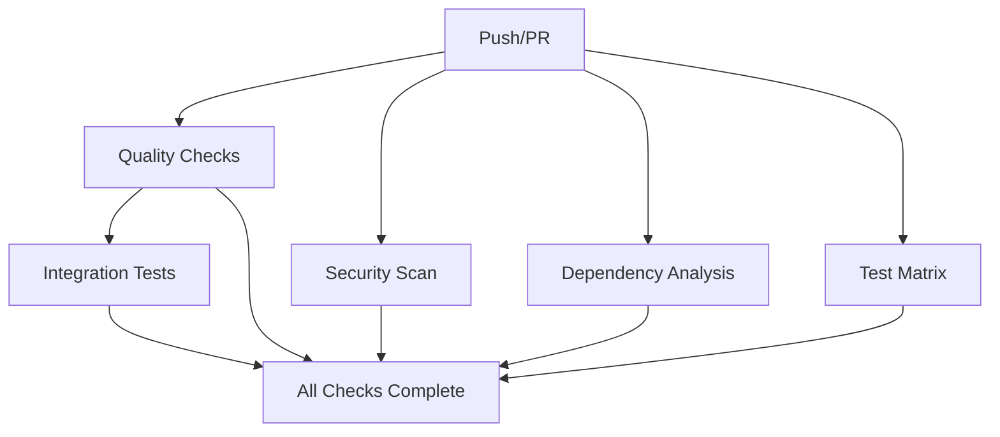

# GitHub Actions Workflows

This directory contains GitHub Actions workflows for automated CI/CD processes in the PR Review Checker project.

## Workflows Overview

### 1. Quality Gate (`quality-gate.yml`)

**Purpose**: Essential quality checks that must pass for every commit and PR.

**Triggers**:
- Push to `main` or `develop` branches
- Pull requests to `main` or `develop` branches

**Features**:
- ✅ Code formatting verification (Prettier)
- ✅ Linting checks (ESLint)
- ✅ Build verification
- ✅ Test execution (if tests exist)
- ✅ Security vulnerability scanning (npm audit)

**Node.js Version**: 18.x (LTS)

### 2. CI/CD Pipeline (`ci.yml`)

**Purpose**: Comprehensive testing and validation pipeline with advanced features.

**Triggers**:
- Push to `main` or `develop` branches
- Pull requests to `main` or `develop` branches

**Jobs**:

#### Quality Checks
- Code formatting and linting
- Build verification
- Basic quality gates

#### Security Scanning
- **npm audit**: Dependency vulnerability scanning
- **TruffleHog OSS**: Secret detection and security scanning
- Comprehensive security analysis across all packages

#### Dependency Analysis
- Outdated package detection
- License compliance checking
- Dependency health monitoring

#### Multi-Version Testing
- **Node.js Versions**: 16.x, 18.x, 20.x
- Cross-version compatibility testing
- Build verification across versions

#### CODEOWNERS Validation
- Validates presence of CODEOWNERS file
- Ensures proper repository governance
- Only runs on pull requests

#### PR-Specific Checks
- **Semantic Title Validation**: Ensures PR titles follow conventional commit format
  - Valid formats: `feat:`, `fix:`, `docs:`, `style:`, `refactor:`, `test:`, `chore:`
  - Optional scope: `feat(auth): add login feature`
- **PR Size Analysis**: Warns about large PRs (>50 files or >1000 lines)
- Automated PR labeling and analysis

#### Integration Tests
- Server startup and health checks
- End-to-end integration testing
- Service connectivity validation

#### Final Status Check
- Aggregates all job results
- Provides comprehensive status summary
- Fails if any critical job fails

## Configuration

### Environment Variables
- `NODE_VERSION_MATRIX`: Defines Node.js versions for testing

### Branch Protection
These workflows are designed to work with branch protection rules:
- `main` branch requires PR reviews
- Status checks must pass before merging
- Workflows provide required status checks

## Security Features

### Secret Detection
- TruffleHog scans for accidentally committed secrets
- Validates against known secret patterns
- Only reports verified secrets to reduce noise

### Dependency Security
- Multi-level npm audit (root, client, server)
- Moderate severity threshold
- License compliance checking

### Access Control
- CODEOWNERS file validation
- PR approval requirements
- Automated security scanning

## Usage

### For Developers
1. **Before Committing**: Run local checks
   ```bash
   npm run format:check
   npm run lint
   ```

2. **Creating PRs**: Ensure title follows semantic format
   - ✅ `feat: add new authentication system`
   - ✅ `fix(api): resolve rate limiting issue`
   - ❌ `updated some files`

3. **Large Changes**: Consider breaking into smaller PRs if warned

### For Maintainers
1. **Required Checks**: All quality-gate jobs must pass
2. **Security Alerts**: Monitor security-scan job results
3. **Dependency Updates**: Review dependency-analysis warnings

## Workflow Dependencies



## Customization

### Adding New Checks
1. Add new job to appropriate workflow
2. Update dependencies in `all-checks-complete` job
3. Test with draft PR

### Modifying Node.js Versions
Update `NODE_VERSION_MATRIX` environment variable and strategy matrix.

### Security Thresholds
Modify `--audit-level` in npm audit commands to adjust sensitivity.

## Troubleshooting

### Common Issues

1. **Formatting Failures**
   ```bash
   npm run format
   ```

2. **Linting Errors**
   ```bash
   npm run lint:fix
   ```

3. **Build Failures**
   - Check Node.js version compatibility
   - Verify all dependencies are installed

4. **Security Alerts**
   - Review npm audit output
   - Update vulnerable dependencies
   - Check TruffleHog results for secrets

### Workflow Debugging
- Check Actions tab in GitHub repository
- Review job logs for specific error details
- Use workflow dispatch for manual testing

## Best Practices

1. **Keep PRs Small**: Aim for <50 files and <1000 lines
2. **Semantic Titles**: Use conventional commit format
3. **Security First**: Address security warnings promptly
4. **Test Locally**: Run checks before pushing
5. **Monitor Dependencies**: Keep packages updated

## Integration with Development

These workflows integrate with:
- **Prettier**: Code formatting
- **ESLint**: Code linting
- **npm scripts**: Build and test processes
- **CODEOWNERS**: Repository governance
- **Branch protection**: Merge requirements 