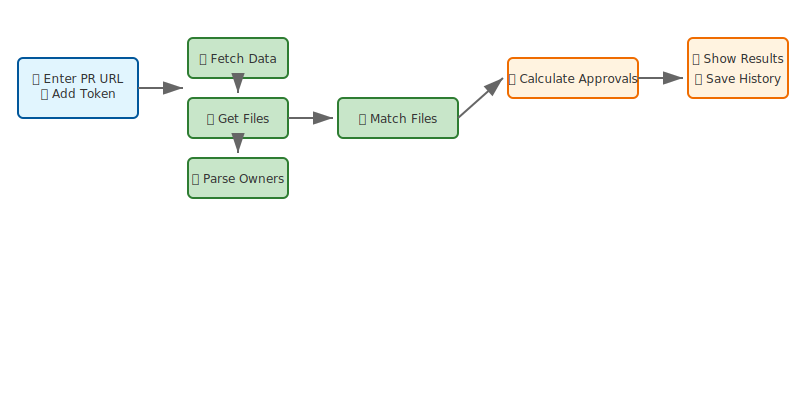

# 🚀 PR Approval Finder v7.0

<div align="center">


**A modern web application that analyzes GitHub Pull Requests to determine minimum required approvals based on CODEOWNERS files. Now featuring AI-powered approval predictions that learn from your team's historical patterns.**

[🚀 Live Demo](https://pr-reviewer.aswinlocal.in/) • [📖 Documentation](./docs) • [🐛 Report Bug](https://github.com/Aswin-coder/pr-review-checker/issues) • [💡 Request Feature](https://github.com/Aswin-coder/pr-review-checker/issues)

</div>

## ✨ Features

### 🎯 **Core Functionality**
- **🔍 Smart CODEOWNERS Analysis** - Parses CODEOWNERS files with advanced glob pattern matching
- **📊 Minimum Approval Calculation** - Determines exact number of approvals needed
- **📁 File-by-File Breakdown** - Shows which files require which approvers
- **⚡ Real-time PR Status** - Displays current approval status and progress
- **👥 Team Integration** - GitHub team support with member visualization

### 🧠 **AI-Powered Features (NEW!)**
- **Machine Learning Predictions**: Predicts approval likelihood based on historical patterns
- **Smart Approval Chances**: Shows percentage likelihood next to each reviewer
- **Pattern Recognition**: Learns from file types, directories, and past approvals
- **Seamless Integration**: ML predictions appear inline with existing CODEOWNERS
- **Enhanced Training**: Improved PR fetching system can analyze 1000+ PRs
- **Duplicate Prevention**: Smart duplicate handling prevents model bias

### 🎨 **Modern UI/UX**
- **🎭 8 Beautiful Themes** - Light, Dark, Ocean, Forest, Sunset, Midnight, Arctic, Cherry
- **📱 Fully Responsive** - Perfect experience on desktop, tablet, and mobile
- **💫 Smooth Animations** - Skeleton loaders, slide effects, and micro-interactions
- **🌟 Modern Design** - Clean UI with backdrop blur and smooth transitions
- **🎯 Accessibility First** - WCAG 2.1 compliant with keyboard navigation

### 🚀 **Advanced Features**
- **📈 Progress Visualization** - Animated SVG progress rings with completion stats
- **📚 PR History** - Local storage of recent PRs with quick access
- **🔀 Basic/Advanced Views** - Toggle between simplified and detailed analysis
- **👥 Team Management** - GitHub team integration with member visualization
- **💬 Feedback System** - Built-in feedback form for user suggestions

### 🔒 **Security & Privacy**
- **🛡️ Privacy First** - No server storage, all data kept locally
- **🔐 Optional GitHub Tokens** - Works with public repos, supports private with tokens
- **🚫 No Tracking** - No analytics, cookies, or personal data collection
- **🔒 Secure Communication** - HTTPS only with direct GitHub API calls
- **⚙️ Rate Limit Handling** - Smart retry logic with rate limit visualization

---

## 🔄 How It Works

Our application follows a simple yet powerful workflow to analyze your Pull Requests:



### CODEOWNERS Analysis Process

Here's how we intelligently group files and determine required approvals:



---

## 🚀 Getting Started

### Prerequisites

```bash
Node.js >= 18.0.0
npm >= 8.0.0
```

### Quick Start

```bash
# Clone the repository
git clone https://github.com/Aswin-coder/pr-review-checker.git
cd pr-review-checker

# Install dependencies
npm install

# Start development server
npm run dev
```

🌐 **Open your browser**: [http://localhost:3000](http://localhost:3000)

### Alternative Installation Methods

<details>
<summary>📦 Using Docker</summary>

```bash
# Build and run with Docker
docker-compose up --build

# Or run individual services
docker run -p 3000:3000 pr-approval-finder
```

</details>

<details>
<summary>🔧 Manual Setup</summary>

```bash
# Install dependencies for each service
npm install
cd client && npm install
cd ../server && npm install

# Start services separately
npm run server  # Terminal 1
npm run client  # Terminal 2
```

</details>

---

## 📖 Usage

### Basic Usage

1. **📝 Enter GitHub PR URL**
   ```
   https://github.com/owner/repo/pull/123
   ```

2. **🔑 Add GitHub Token (Optional)**
   - For private repositories
   - Higher rate limits (5000 vs 60 requests/hour)
   - Team member visibility

3. **🔍 Analyze & Review**
   - View minimum required approvals
   - See detailed file-by-file breakdown
   - Track approval progress in real-time

### 🧠 AI Features Setup

1. **Train the ML Model** (Enhanced v7.0)
   ```bash
   # Train on large datasets (up to 1000+ PRs)
   node train-model.js owner repo your_token 1000
   
   # Interactive demo script
   ./ml-demo.js
   ```

2. **See Smart Predictions**
   - Approval percentages appear next to reviewers
   - Higher percentages = more likely to approve
   - Based on historical patterns from your repo

3. **Model Management** (NEW!)
   ```bash
   # Check model status and duplicates
   node model-utils.js status
   
   # Remove duplicate training data
   node model-utils.js remove-duplicates
   
   # View detailed statistics
   node model-utils.js stats
   
   # Clear model for fresh start
   node model-utils.js clear
   ```

For detailed ML setup, see [docs/ML_CODEOWNERS.md](docs/ML_CODEOWNERS.md)

### Advanced Features

<details>
<summary>🎨 Theme Customization</summary>

Choose from 8 professionally designed themes:
- ☀️ **Light** - Clean and bright (default)
- 🌙 **Dark** - Easy on the eyes
- 🌊 **Ocean** - Deep blue vibes
- 🌲 **Forest** - Natural green tones
- 🌅 **Sunset** - Warm orange hues
- 🌌 **Midnight** - Deep purple night
- ❄️ **Arctic** - Cool blue-white
- 🌸 **Cherry** - Soft pink accents

</details>

<details>
<summary>🔒 Privacy & Security</summary>

Our application prioritizes your privacy and security with comprehensive protection:



**Click the 🔒 Privacy and 🛡️ Cloudflare buttons in the app footer** to view detailed information about:
- **No Server Storage** - All data stays in your browser
- **Local Storage Only** - Tokens and history stored locally  
- **No Tracking** - Zero analytics or data collection
- **Cloudflare Protection** - Enterprise-grade security and performance
- **Open Source** - Full code transparency

</details>

<details>
<summary>⚙️ Configuration Options</summary>

Create `.env` files for customization:

```env
# Server configuration
GITHUB_TOKEN=your_github_token_here
PORT=3001
NODE_ENV=production

# Client configuration
REACT_APP_API_URL=http://localhost:3001
```

</details>

---

## 🏗️ Architecture

### Tech Stack

**Frontend**
- ⚛️ React 18 with Hooks
- 🎨 CSS3 with Custom Properties (CSS Variables)
- 📱 Responsive Design with CSS Grid/Flexbox
- 🌐 Axios for API requests
- 🎭 8-theme system with persistence

**Backend**
- 🚀 Node.js + Express
- 🔗 GitHub REST API v3
- 🔍 Minimatch for glob patterns
- 🛡️ CORS enabled
- 📧 Nodemailer for feedback system
- 🧠 ML Training system with enhanced PR fetching

**DevOps**
- 🚀 VPS server for production deployment
- 📦 npm for package management
- 🧪 Jest for testing
- 📝 ESLint + Prettier
- 🐳 Docker support

### Key Components

```
├── 🎨 Theme System          # CSS variables with persistent storage
├── 💀 Skeleton Loaders      # Beautiful loading animations
├── 📊 Progress Visualization # SVG-based progress rings
├── 📱 Responsive Grid       # CSS Grid for adaptive layouts
├── 🔍 Pattern Matching      # Advanced glob pattern support
├── 🔒 Privacy Modal         # Comprehensive privacy information
├── 💬 Feedback System       # User feedback collection
├── 🧠 ML Training System    # Enhanced PR fetching and duplicate handling
└── 🚀 Performance Optimized # Lazy loading and memoization
```

---

## 🧪 Testing

```bash
# Run all tests
npm test

# Run tests with coverage
npm run test:coverage

# Run tests in watch mode
npm run test:watch

# Run specific test suite
npm run test:client
npm run test:server
```

### Test Coverage
- ✅ Component testing with React Testing Library
- ✅ API endpoint testing with Supertest
- ✅ Integration testing for core workflows
- ✅ GitHub API mocking for reliable tests

---

## 🚀 Deployment

### Docker (Recommended for Production)

```bash
# Build production image
docker build -t pr-approval-finder .

# Run production container
docker run -p 3000:3000 pr-approval-finder

# Or use docker-compose
docker-compose up --build
```

### VPS Server Deployment

```bash
# Build for production
npm run build

# Start production server
npm start

# Or use PM2 for process management
pm2 start server/index.js --name pr-approval-finder
```

### Branch Preview (Vercel)

> **Note**: Vercel is used exclusively for PR branch previews and development testing, not for production deployment.

```bash
# Deploy PR preview to Vercel
vercel

# Preview branch deployment
vercel --prod
```

---

## 🤝 Contributing

We love contributions! Please see our [Contributing Guide](./CONTRIBUTING.md) for details.

### Development Workflow

1. 🍴 Fork the repository
2. 🌿 Create your feature branch (`git checkout -b feature/amazing-feature`)
3. 🔧 Make your changes
4. ✅ Run tests (`npm test`)
5. 📝 Commit your changes (`git commit -m 'Add amazing feature'`)
6. 🚀 Push to the branch (`git push origin feature/amazing-feature`)
7. 🎯 Open a Pull Request

### Code Style

We use Prettier and ESLint to maintain consistent code style:

```bash
# Format code
npm run format

# Lint code
npm run lint

# Fix linting issues
npm run lint:fix
```

---

## 📊 Performance

- ⚡ **Optimized Bundle** - Tree shaking and code splitting
- 🚀 **Fast Loading** - Skeleton loaders for perceived performance
- 📱 **Mobile Optimized** - Touch-friendly interface
- 🔄 **Efficient Caching** - Smart API response caching
- 📈 **Lightweight** - Minimal dependencies

---

## 🔧 API Reference

### Endpoints

```typescript
POST /api/pr-approvers
{
  "prUrl": "https://github.com/owner/repo/pull/123",
  "githubToken": "optional_token"
}

POST /api/ml/train
{
  "owner": "repo-owner",
  "repo": "repo-name", 
  "token": "github-token",
  "prCount": 1000
}

POST /api/ml/predict
{
  "files": ["src/file.js"],
  "confidence": 0.3
}

GET /api/ml/status
GET /api/ml/stats
POST /api/ml/clear
POST /api/ml/remove-duplicates
```

### Response Format

```typescript
{
  "prInfo": {
    "title": "PR Title",
    "number": 123,
    "author": "username",
    "state": "open",
    "url": "https://github.com/owner/repo/pull/123"
  },
  "minRequiredApprovals": [
    {
      "files": ["src/component.js"],
      "ownerDetails": [...],
      "needsApproval": true,
      "approvedBy": null
    }
  ],
  "totalGroupsNeedingApproval": 2,
  "approvals": ["reviewer1"],
  "requestedReviewers": ["reviewer2"],
  "mlPredictions": {
    "predictions": [
      {
        "approver": "developer1",
        "confidence": 0.85
      }
    ]
  },
  "rateLimitInfo": {
    "limit": 5000,
    "remaining": 4999,
    "resetTime": "2025-01-01T12:00:00Z"
  }
}
```

---

## 📞 Support

- 🐛 **Issues**: [GitHub Issues](https://github.com/Aswin-coder/pr-review-checker/issues)
- 💡 **Feature Requests**: [GitHub Issues](https://github.com/Aswin-coder/pr-review-checker/issues)
- 💬 **Feedback**: Use the feedback button in the app
- 📖 **Documentation**: [Full Documentation](./docs)

---

## 📄 License

This project is licensed under the MIT License - see the [LICENSE](LICENSE) file for details.

---

## 🙏 Acknowledgments

- 💝 Built with ❤️ using React and Node.js
- 🔗 GitHub API for PR and CODEOWNERS data
- 🎨 Modern CSS techniques for beautiful UI
- 🔍 Minimatch library for glob pattern matching
- 🚀 VPS server for production hosting
- 🔧 Vercel for PR branch previews
- 🤖 Cursor AI for development assistance

---

## 🔍 How It Works

1. **📥 Input Processing** - Validates GitHub PR URL format
2. **🔗 API Integration** - Fetches PR data and CODEOWNERS from GitHub
3. **🧮 Pattern Matching** - Uses minimatch to match files against CODEOWNERS patterns
4. **👥 Team Resolution** - Resolves GitHub teams to individual members
5. **📊 Analysis** - Calculates minimum required approvals based on file changes
6. **🧠 ML Predictions** - Uses trained models to predict approval likelihood
7. **🎨 Visualization** - Presents results with interactive progress indicators

---

<div align="center">

**© 2025 [Aswin](https://github.com/Aswin-coder)** • *Crafted with Cursor AI*

[](https://github.com/Aswin-coder/pr-review-checker/stargazers)
[](https://github.com/Aswin-coder/pr-review-checker/network/members)

**⭐ Star this repo if you find it helpful!**

</div> 